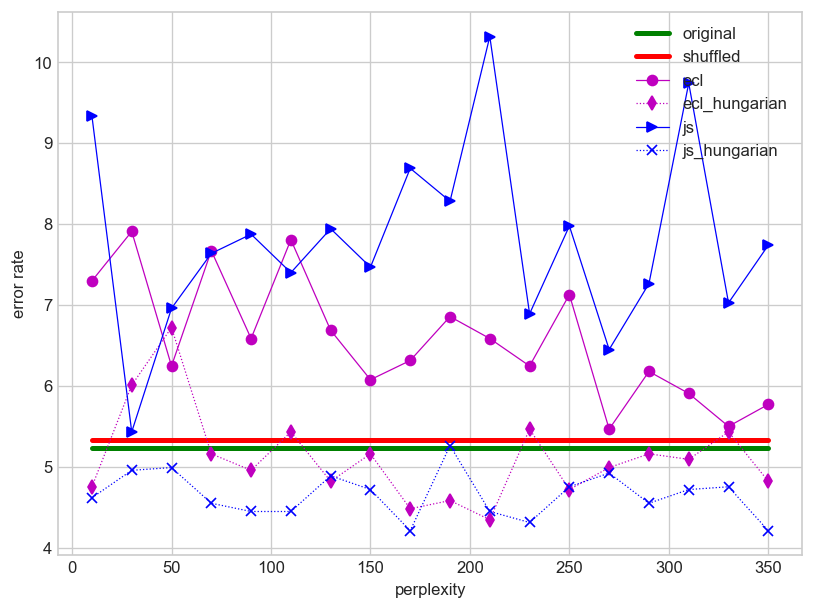
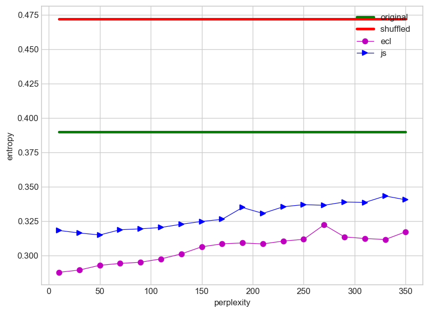
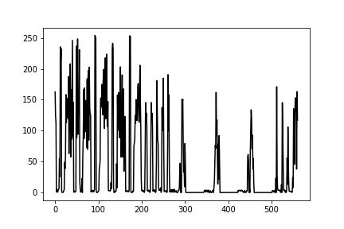
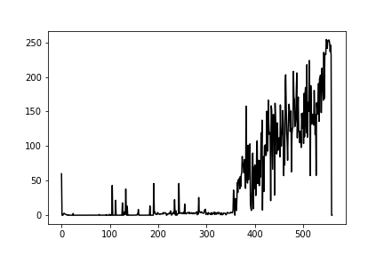

**Figure**: Accuracy for different perplexities of t-SNE using the transformed Human Activitiy Recognition Using Smartphones (HARUS) dataset. Also shows how our feature embedding method achieved superior results using Euclidean and JS distance metrics.

**Figure**: Entropy after applying the feature embedding method to the same datasets is much lower. Because of the specific way entropy was calculated, this experiment proves the introduction of local structures in the samples.

**Purpose of this Project**
This project is to prove the efficacy of the feature embedding method we developed. CNN performs exceptionally well with image data, sometimes the performance even surpasses human levels. For non-image data, their performances are not as impressive. As humans, we intuitively understand what is an image and what is not. If we take a non-image dataset, and scale/transform the samplet to make them look like images, there is a higher chance that the image will look like noise. So just scaling and transforming non-image data does not work. Natural images have shapes. We can think of the shapes as a collection of local structures (think about the nose and the eyes in the image of a human face). Using the feature embedding method, we try to transform, scale ***and also*** reorganize the features so that non-image data now contain local structures similar to natural images. Since CNN (ConvNet) take advantage of features in a neighborhood (while using the sliding windows and learning the weights), new newly organized features of non-image data samples are expected to show better performance.

  
  

In the figures above we can see two images. The left is a direct transformation of a document. The rigt one shows a sample after applying the feature embedding method has been applied. It is important to note that feature re-organization is not the same as sorting. Sorting would result in losing minute differences in samples and the performance could be worse. After applying the feature embedding method, Documents belonging to similar categories should hold onto their internal structures. Samples coming from different categories should look different. The expectation is that the sliding window will pick up the minute differences. This will show up in the performance.
**Directions**
Please go to https://dl.acm.org/doi/10.1145/3299815.3314429 for details of the feature embedding method. Once done, use the files in the following order.

How it works?

1. get a non-image dataset that satisfies the contraints of the above paper
2. generate distance_matrix using js_geodesic.py
3. generate t-SNE mappings for Jensen-Shannon (JS) using the distance matrix, and for Euclidean distance use the training set;
4. find the array representation using generate_tsne_mapped_dataset_ecl.py or generate_tsne_mapped_dataset_js.py
5. use the datasets with CNN; I used PyTorch; You may use TensorFlow. It doesn't matter.

If the performance doesn't improve, use Hungarian method. 

To measure entropy, use the quantize_dataset_singlefile_bucket.py file. Note that entropy can be measured in many ways. Here we have tried to divide the entire range of feature values into buckets, and use the bucket index as a patch label.
